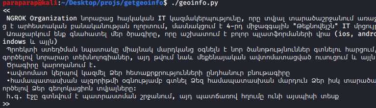

# install/start

$ sudo apt update && apt upgrade -y  

$ sudo apt install git  

$ git clone https://github.com/paraparap/getgeoinfo  

$ cd getgeoinfo  

$ sudo chmod +x install.sh  

$ sudo ./install.sh  

$ sudo ./geoinfo.py

# and in new terminal

$ cd getgeoinfo  

$ sudo ./ngrok http 8080

<h2>Send this text</h2>

 

<h2>and this link to the victim.</h2>

 

<h2>He will see such an interface and messages.</h2>

 

<h2>When he clicks "allow",</h2>

 

<h2>you will see a lot of information about the victim in the terminal, such as os, platform, cpu, ram, gpu, resolution, browser, public ip, continent, country, region, city, gps location, speed etc.</h2>
